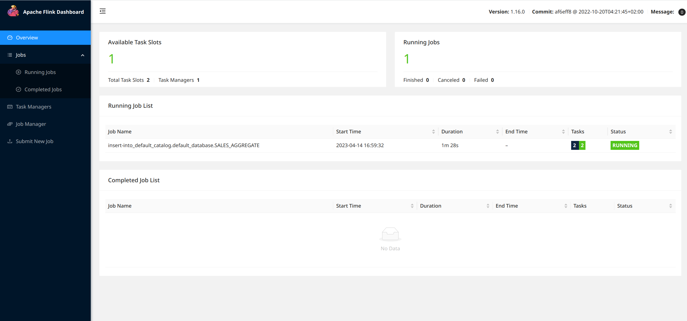

## :bulb: Introduction

In this new blog post, we build on the [infrastructure](https://github.com/theodorecurtil/kafka_101) and the [Kafka producer](https://github.com/theodorecurtil/kafka_sales_producer) introduced in the first two blog posts of our **Kafka 101 Tutorial** series. We simulate a company receiving sales events from its many physical stores inside its Kafka infrastructure, and we introduce the basic [Apache Flink](https://flink.apache.org/) architecture to do streaming analytics on top of these sales events.

Specifically, for this use case we will aggregate sales events per store and provide the total sales amount per store per time window. The output stream of aggregated sales will then be fed back to the Kafka infrastructure - and the new data type registered in the schema registry - for downstream applications. We do a time based aggregation as this is a basic example of time based analytics one can do with Apache Flink. For this first Flink based blog post, we will be using the Flink SQL API. In a future blog post, we will look at the more powerful Java API.

## :whale2: Requirements

To get this project running, you will just need minimal requirements: having [Docker](https://www.docker.com/) and [Docker Compose](https://docs.docker.com/compose/) installed on your computer.

The versions I used to build the project are

```bash
## Docker
docker --version
> Docker version 23.0.3, build 3e7cbfdee1

## Docker Compose
docker-compose --version
> Docker Compose version 2.17.2
```

If your versions are different, it should not be a big problem. Though, some of the following might raise warnings or errors that you should debug on your own.

## :factory: Infrastructure

We will start by getting the infrastructure up and running on our local computer. To do so, nothing simpler! Simply type the following commands in

```bash
## Clone the repo
git clone https://github.com/theodorecurtil/flink_sql_job.git

## cd to the repo
cd flink_sql_job

## docker-compose the infra
docker-compose up -d
```

This will bring up the Kafka infrastructure we are familiar with, as well as the Kafka sales producer we introduced in our latest blog post. The producer starts producing immediately at a frequency of 1 message per second. You can check that everything is running properly by navigating to the Confluent Control Center UI on [localhost:9021](http://localhost:9021/clusters). Then go to the `Topics` tab and click the **SALES** topic. This is the topic the Kafka producer is producing to. You should see something similar to the following.


:chipmunk: You might spot from the [docker-compose](https://github.com/theodorecurtil/flink_sql_job/blob/main/docker-compose.yaml) file that 3 services are spawned at the end of the file, that seem Flink related.

```console
version: '3.3'
services:
  ...
    
  jobmanager:
    ...

  taskmanager:
    ...

  sql-client:
    ...
```

The `jobmanager` container supports the Flink Job Manager, and the `taskmanager` the Flink Task Manager. For a reminder or a crash course about the Flink architecture, check [this link](https://nightlies.apache.org/flink/flink-docs-master/docs/concepts/flink-architecture/). Basically, a Flink cluster is composed of a job manager and one or multiple task managers. The job manager is responsible for distributing the work to the task managers, and task managers do the actual work.

The third service - `sql-client` - is the SQL client that will allow us to submit SQL jobs to our Flink cluster. In a typical production environment, Flink jobs will be designed using the Java/Scala API, and there is no need for the SQL client. For test cases, this SQL client remains convenient.

Flink ships with a very nice UI. You can access it on [localhost:18081](http://localhost:18081/#/overview). If you follow this link, you should see something like the following


You can see that 1 task manager is registered - since we started a single task manager container - with 2 available task slots and 0 running job. There are 2 task slots as we specifically created 1 task manager with 2 task slots - `taskmanager.numberOfTaskSlots: 2` config in the `taskmanager` - totalling to 2 task slots.

## :zap: Let's do some streaming analytics

Now that everything is up and running is time to showcase the power of Apache Flink.

As a reminder, we have a Kafka producer producing fake sales records for 3 stores, every second. One possible analytics would be to aggregate the total sales per store to compare which stores make more sales than others. And because why not, let us aggregate per 1-minute time window as well, using tumbling windows. Tumbling windows have a fixed time length and do not overlap. The picture from Flink documentation illustrates this very well.


Our output stream from Flink will be 1 data point per store per minute. For this specific use case, we will feed the data stream back to Kafka in a new topic, but Flink also supports sinking to a SQL database for example, or also custom sinks such as a Redis sink; depends on the requirements. I like sinking back to Kafka to have a centralized stream catalog, I find it easier on the consumer/downstream side.

The logic is implemented in a [.sql](https://github.com/theodorecurtil/flink_sql_job/blob/main/sql-jobs/sales-aggregate.sql) file. Source and sink tables are created, and then the logic is very simple for this use case

```console
SELECT store_id, window_start, window_end, sum(sale_amount) as aggregated_sales
FROM TABLE(TUMBLE(TABLE SALES, DESCRIPTOR(sale_ts), INTERVAL '60' SECONDS))
GROUP BY store_id, window_start, window_end;
```

This very simple SQL expression tells Flink to assign sales events to time buckets (those 1-minute-wide tumbling windows), and to then compute the total sales per `store_id` per `window_start` timestamp.

We are using the actual timestamps of the sales events to measure time and group observations; this is refered to as event time in Flink. Flink supports another type of time to keep track of time and ordered events: processing time. With event time, events flowing into Flink carry their timestamps (like the exact timestamps when the sales happened).

### :chipmunk: Start the Flink job

To start the Flink job, we need to enter the `sql-client` container and start the job manually by passing the `.sql` file. To start the job, type the following commands

```bash
## Enter the SQL client
docker exec -it sql-client bash

## Start the job
flink@sql-client~$ sql-client.sh -f sales-aggregate.sql
```

The SQL client should then show the following output

```bash
[INFO] SQL update statement has been successfully submitted to the cluster:
Job ID: c984a31a8e94fd41025f55621c2f7d02


Flink SQL> 
Shutting down the session...
done.
```

where the Job ID would be different for you, as it is randomly generated. We can also see that the job is running by going to the Flink UI on [localhost:18081](http://localhost:18081/#/overview).

You can see the job running on the main view of the UI, and then see more details about the running job.




